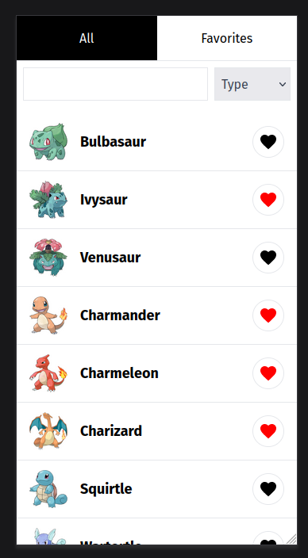
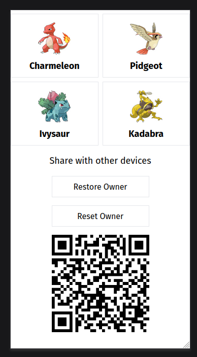

# Local-first PWA Pokémon Viewer

| All Pokémons               | Favorite Pokémons                |
| -------------------------- | -------------------------------- |
|  |  |

This is a PWA, primarily designed for mobile devices

- PWA is based on the Next.js project, which integrates a sample GraphQL API
- The GraphQL API only allows to fetch pokémon data, the list of fetched pokémon is displayed on the main page of the application (All tab). It implements an infinite scroll, where additional pokémon are loaded in sequence. Clicking on the name of a Pokémon takes you to the detail
- To search for a Pokémon you can limit the selection by filtering by type or by name
- Local-first approach is chosen for storing favorite pokémons
- To do this there is a proxy endpoint API for loading images and converting them to base64
- So locally, when you click on the heart icon, the name of the Pokémon and its image is saved in the WASM SQLite database
- Locally stored Pokémon can be viewed offline
- It is also possible to share a selection of favorite Pokémon by scanning the QR code with other devices
